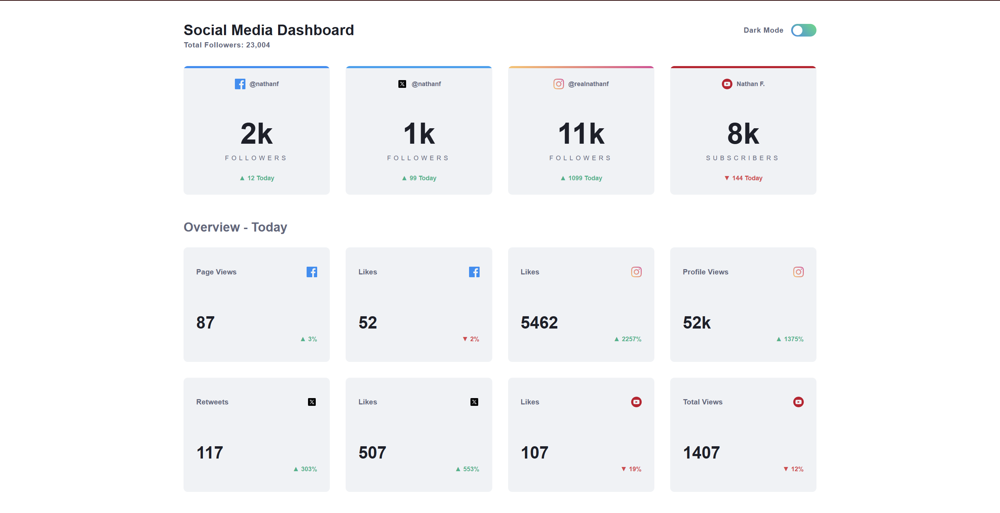
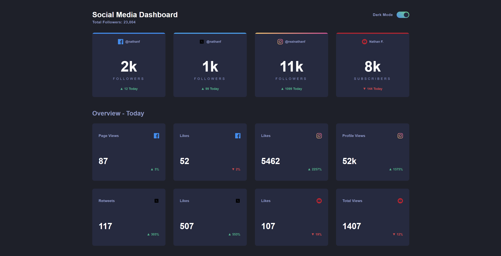

# Frontend Mentor - Social media dashboard with theme switcher solution

Ceci est une solution au [défi Social media dashboard with theme switcher sur Frontend Mentor](https://www.frontendmentor.io/challenges/social-media-dashboard-with-theme-switcher-6oY8ozp_H). Ce challenge m’a permis d’améliorer mes compétences en développement front-end à travers un projet réaliste.

## Table des matières

- [Aperçu](#aperçu)
  - [Le challenge](#le-challenge)
  - [Capture d’écran](#capture-décran)
  - [Liens](#liens)
- [Mon processus](#mon-processus)
  - [Construit avec](#construit-avec)
  - [Ce que j’ai appris](#ce-que-jai-appris)
  - [Développements futurs](#développements-futurs)
  - [Ressources utiles](#ressources-utiles)
- [Auteur](#auteur)
- [Remerciements](#remerciements)

## Aperçu

### Le challenge

Les utilisateurs doivent pouvoir :

- Voir une mise en page optimale selon la taille de leur écran
- Voir les états de survol sur tous les éléments interactifs
- Changer le thème de couleur selon leur préférence

### Capture d’écran


Aperçu du dashboard (Light Mode) :



Aperçu du dashboard (Dark Mode) :



### Liens

- Solution URL : [https://github.com/JeremRkt/JeremRkt.github.io.git](https://github.com/JeremRkt/JeremRkt.github.io.git)
- Live Site URL : [https://jeremrkt.github.io/](https://jeremrkt.github.io/)

## Mon processus

### Construit avec

- HTML5 sémantique
- SCSS (variables, mixins)
- Flexbox
- CSS Grid
- Approche mobile-first
- [Angular](https://angular.io/) - Framework front-end
- TypeScript

### Ce que j’ai appris

Ce projet m’a permis de :

- Approfondir l’utilisation d’Angular et de ses composants
- Mettre en place un service de gestion de thème (mode clair/sombre)
- Structurer un projet Angular de façon modulaire
- Utiliser SCSS pour la gestion avancée des styles

Exemple de service Angular pour le thème :

```typescript
@Injectable({ providedIn: 'root' })
export class ThemeService {
  toggleTheme(isDark: boolean) {
    document.body.classList.toggle('dark-theme', isDark);
  }
}

### Author

- Frontend Mentor - [@JeremRkt](https://www.frontendmentor.io/profile/JeremRkt)
